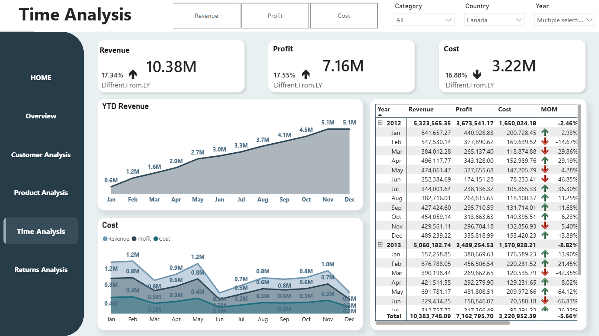
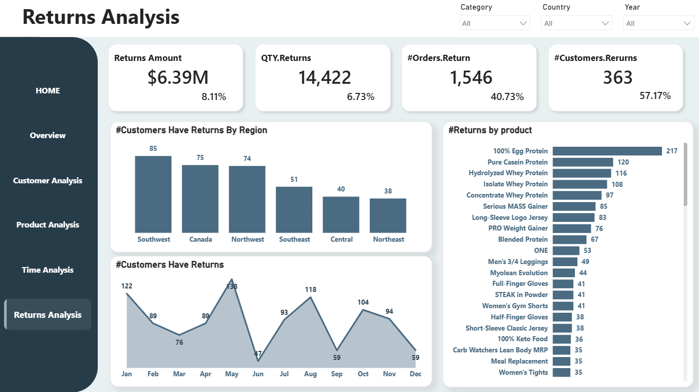

# Athlet Industry Sales Analysis — Power BI Dashboard

> A comprehensive business intelligence project analyzing revenue, profit, costs, returns, and customer behavior across products, regions, and time periods — built to identify trends, optimize strategies, and support data-driven decisions.

---

## Project Overview

| Metric | Value |
|---|---|
| Total Revenue | **$78.87M** |
| Total Profit | **$54.17M** — 66.68% margin |
| Total Cost | **$24.70M** — 31.32% of revenue |
| Total Quantity Sold | **214K units** |
| Total Customers | **635** |
| Total Orders | **3,796** |
| Average Order Value | **$20.78K** |
| Return Rate | **8.11%** |

---

## Data Architecture

### Normalization Schema

The original schema consists of 9 related tables: `F-customers`, `product`, `product-subcategory`, `product-history`, `Geography`, `Region`, `sales-headers`, `sales-details`, and `sales-returns`.

### Data Flow

Raw data from multiple Excel sources was normalized, then denormalized into four analytical tables — Customer, Sales, Product, and Returns — to enable clean Power BI modeling.

### Denormalization Schema

Tables were merged and simplified into a star-schema-ready model to optimize DAX performance and reduce query complexity.

---

## Dashboard Pages

### 1. Sales Overview

- Revenue and GM% tracked over time by quarter
- Revenue breakdown by Category and Business Type
- Country-level revenue comparison (US leads at $19M in 2013)
- YoY growth metrics: Revenue +20.15%, QTY +27.46%, Profit +18.94%

---

### 2. Customer Analysis

- 635 total customers — 66 with no orders placed
- AOV of $20.78K across 3,796 orders
- Order frequency peaks at 4 and 8 orders per customer
- Southwest leads with 115 customers and $12M profit
- Churn analysis tracked across 2010–2013

---

### 3. Product Analysis

- GM% of 68.7% across all products
- Return rate of 8.11% by amount, 40.73% by orders
- Price category breakdown: 0–1000 ($36M), 1000–2000 ($32M), 2000+ ($11M at 71.3% GM)
- Top return products: Whey Protein (441 orders), Egg Protein (373 orders)

---

### 4. Time Analysis

 

- YTD Revenue of $60.59M (+33.68% vs LY)
- Monthly cost trends with Revenue, Profit, and Cost overlay
- Detailed MOM and VAR vs same period last year table
- Seasonal dips visible in June and March

---

### 5. Returns Analysis

- Total returns: $6.39M — 14,422 units across 1,546 orders
- 363 customers (57.17%) had at least one return
- Southwest leads return volume by region (85 customers)
- Peak return months: January (122) and May (138)
- Top returned product: 100% Egg Protein (217 customers)

---

## Key Insights

**Revenue is concentrated** — Protein category drives ~89% of revenue, Warehouse channel accounts for 48% of business.

**Premium tier is under-leveraged** — the 2000+ price category achieves 71.3% GM but contributes only $11M vs $36M for the 0–1000 tier.

**Returns spike in January and May** — two months consistently drive the highest return volumes across regions.

**66 inactive customers** represent up to $1.37M in recoverable revenue at current AOV.

---

## Recommendations

**Capitalize on seasonal peaks** — prioritize inventory and promotions around May and early-year windows.

**Promote premium products** — bundle and upsell 2000+ items to grow the highest-margin segment.

**Reduce returns proactively** — improve descriptions and QC for Egg Protein and Whey Protein before January and May.

**Reactivate inactive customers** — target the 66 zero-order accounts with personalized campaigns and first-order incentives.

**Improve retention** — introduce loyalty programs to push customers beyond the 4–8 order plateau and increase AOV.

---

## Tools

| Tool | Usage |
|---|---|
| Power BI | Interactive dashboards and visualizations |
| Power Query | Data cleaning, merging, and transformation |
| Data Modeling | Star schema design, table relationships |
| DAX | KPIs, calculated measures, time intelligence |

---

## Links

[Power BI Dashpoard](https://tinyurl.com/yyf48k5d)

[LinkedIn Post](https://www.linkedin.com/in/mohamed-hafez-89b719265)
